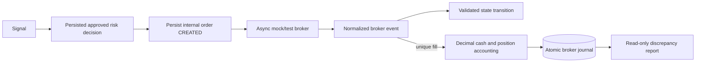

# Phase 2 broker-safety audit

## 1. Scope

Phase 2 adds an asynchronous, persisted broker lifecycle behind domain interfaces. It does not add a strategy, Webull SDK/network client, live mode, production endpoint, AI, LLM, or Hermes integration. The Phase 1 simulator remains the default execution path.

Decision: **READY for the next paper/test architecture phase within the limits below. Phase 3 has not started.**

## 2. Architecture changes

- `run_paper` accepts an injected Phase 1 execution engine and defaults to `PaperExecutionEngine`, preserving prior behavior.
- `Broker` models asynchronous submit/cancel, queries, restart recovery, and reconciliation without assuming immediate fills.
- `BrokerExecutionService` persists intent first and translates normalized `BrokerEvent` objects into lifecycle and accounting changes.
- `MockBroker` supplies deterministic no-network scripted behavior.
- `WebullSandboxAdapter` is isolated and deliberately disabled.

Strategy and risk modules do not import broker-specific types or raw Webull responses.

## 3. Safety guarantees

- Application `MODE` still permits only `paper`.
- Legacy `WebullExecutionEngine.execute` always raises.
- `WebullSandboxAdapter` has no SDK client/transport and every method raises `UnsupportedBrokerFeature`.
- Only `api.sandbox.webull.com` and `events-api.sandbox.webull.com` are accepted by Webull configuration. Any other host or non-`us` region raises safety-critical `UnsafeEnvironmentError`.
- No production endpoint appears in the repository. A negative test uses a reserved invalid host to prove that every non-sandbox endpoint is rejected without embedding a production Webull URL in tests.
- No order-submit HTTP library or Webull SDK dependency was added.
- Credentials are read only from environment variables, never logged or persisted. Diagnostics mask all three values; the account reference is SHA-256 only. `.env` remains ignored.
- No external Webull API call was executed.

## 4. Schema changes

Migration `0004_broker_lifecycle.py` adds five tables without changing Phase 1 rows:

| Table | Purpose |
| --- | --- |
| `broker_accounts` | Run/broker/environment and safe account reference; exact cash |
| `broker_positions` | Exact quantity, weighted basis, gross realized P&L and fees |
| `broker_orders` | Internal/client/broker IDs, signal/risk links, intent, state and cumulative fill quantity |
| `broker_events` | Unique external event ID, normalized state, time/source/reason/disposition and payload hash |
| `broker_fills` | Unique execution ID, exact quantity/price/fee and source-event link |

All monetary and quantity columns use a lossless decimal-text SQLAlchemy type. Empty migrations `0001 → 0004` produce zero model/schema differences and pass SQLite foreign-key checks. A copy of the Phase 1 `0003` database upgrades through `0004` and retains readable history. Application behavior does not call `create_all`.

## 5. Order lifecycle

States: `CREATED`, `SUBMITTING`, `SUBMITTED`, `ACKNOWLEDGED`, `PARTIALLY_FILLED`, `FILLED`, `CANCEL_PENDING`, `CANCELLED`, `REJECTED`, `EXPIRED`, and `UNKNOWN`.

`FILLED`, `CANCELLED`, `REJECTED`, and `EXPIRED` are terminal. Legal transitions are explicit. Illegal terminal regressions raise `InvalidOrderTransition`. A fill may legally arrive before acknowledgment/status persistence; cumulative fill quantity determines partial/full state. A late acknowledgment is retained with `OUT_OF_ORDER_IGNORED` and cannot regress accounting or state.

## 6. Reconciliation

The service queries broker open orders, known order details, fills, positions, and account state. `reconcile` compares them with persisted internal orders, execution IDs, positions, environment/account reference, and cash. It returns `MATCH`, `LOCAL_MISSING`, `BROKER_MISSING`, `STATUS_MISMATCH`, `QUANTITY_MISMATCH`, `CASH_MISMATCH`, `POSITION_MISMATCH`, or `UNKNOWN`.

Tests cover a full match and simultaneous order/status/cash/position discrepancies. Reconciliation is detection-only: it performs no update, deletion, or repair.

## 7. Restart/recovery evidence

Separate Python processes reopen the same migrated SQLite database and recover the same internal/client order IDs from each persisted state: after internal creation, during submission, after submission, after acknowledgment, after a partial fill, and while cancellation is pending.

Further tests commit a first partial fill, close the session, apply a final fill in a new session, then replay the broker history. Exact cash, weighted basis, cumulative quantity, IDs, event counts, and fill counts remain stable. A simulated crash after final-fill application but before transaction commit rolls back the event, fill, cash and position together; recovery applies it once.

The design never automatically retries submission. An adapter must establish client-order-ID idempotency before the caller retries an ambiguous submit.

## 8. Idempotency evidence

- Internal order ID is the primary key and trace anchor.
- Client order ID is unique.
- Broker order ID is unique within broker/environment when known.
- Broker event ID and execution ID are unique.
- Identical event replay returns its stored row and causes no financial mutation.
- Reusing an event/execution/internal ID with a changed payload raises `DuplicateBrokerEvent`.
- Late non-fill status events remain auditable and cannot regress state.
- Overfills and oversells fail before accounting changes.

## 9. Accounting evidence

Only fills change cash, position quantity, weighted average basis, realized P&L, or fees. Submit, acknowledgment, reject, cancel-pending and cancellation events do not.

The deterministic multi-fill test buys 2 shares at 100.01, 2 at 100.02, and 1 at 99.99. It persists three fills, quantity 5, exact weighted basis 100.01, fees 0.06, and cash 9499.89. A restart test buys 2 at 100 then 3 at 110, producing exact average basis 106 and cash 9469.97 after 0.03 fees. Duplicate fill replay does not change these values. Rejection and zero-fill lifecycle events create no position and charge no fee.

## 10. Decimal/precision policy

At the Phase 2 broker boundary, finite values are parsed through `Decimal(str(value))`. Database persistence stores canonical decimal text and reconstructs `Decimal`, avoiding SQLite's binary floating-point conversion. No quantization or silent rounding occurs.

`InstrumentRules` optionally validates exact modulo against supplied price and quantity increments. `None` means the rule is unknown and no value is invented. Quote timestamps are timezone-aware. Staleness is enforced only when an explicit, versioned `quote_age_limit_seconds` is supplied; no production threshold or exchange calendar was guessed.

Phase 1 continues using floats under its audited `1e-8` tolerance so historical output remains unchanged.

## 11. Official Webull documentation findings

Reviewed on 2026-09-12:

- [SDKs and Tools](https://developer.webull.com/apis/docs/sdk/) documents separate production and test environments. Test Trading API host is `api.sandbox.webull.com`; test Trading Events host is `events-api.sandbox.webull.com`.
- [Trading API Application](https://developer.webull.com/apis/docs/authentication/IndividualApplicationAPI/) documents Sandbox Trading API applications/accounts and states sandbox and production are isolated.
- [Trading API Getting Started](https://developer.webull.com/apis/docs/trade-api/getting-started/) documents client-generated `client_order_id`, order placement/cancellation, account lookup, and asynchronous gRPC status events.
- [OpenAPI welcome](https://developer.webull.com/apis/docs/) describes the documented product as US-market OpenAPI.

No official Webull Thailand OpenAPI page proving Thailand account eligibility or equivalent sandbox behavior was found. The code therefore claims only the documented US sandbox host boundary and makes no Thailand account assumption. No tick-size or quantity-step metadata was inferred.

## 12. Webull test/sandbox status

The official docs confirm a Sandbox Trading API exists. This repository has safe configuration/mapping boundaries for it, but no official SDK dependency, network transport, or runnable sandbox submission. No credentials or positively identified sandbox account were provided. Therefore the optional external integration test was not added or run. The adapter stays disabled and fail-closed.

## 13. Test results

Final suite: **71 tests passed**: 50 Phase 1 cases plus 21 Phase 2 cases. Phase 2 covers dependency injection, lifecycle transitions, illegal transitions, identifier mapping, async submit/ack, multiple partial fills, duplicate and out-of-order events, partial cancellation, rejection, restart states in separate processes, rollback/recovery, reconciliation, Decimal persistence, freshness, instrument increments, missing/masked credentials, production-host rejection, disabled Webull operations, no-network mock operation, oversell protection, per-fill fees, weighted basis, and coexistence of local paper plus Webull keys in an ignored `.env` file.

## 14. Known limitations

- Webull adapter is intentionally non-operational; official SDK mapping and optional sandbox contract testing remain future work.
- Mock events model terminal snapshots, not a broker's full correction/bust semantics. No correction behavior was invented because the reviewed docs did not establish it.
- Phase 2 broker accounting is isolated from the Phase 1 trade-metrics lifecycle. It proves safe event/accounting infrastructure; mapping broker fills into closed Phase 1-style trade metrics belongs to a later explicit phase.
- SQLite is verified; PostgreSQL integration is still untested.
- No exchange calendar, tick metadata, quantity metadata, regulatory fee model, or automatic reconciliation repair is included.
- One database transaction must contain each normalized event and accounting mutation. The service is not a distributed transaction coordinator.

## 15. Exact files changed

Modified:

- `.env.example`
- `README.md`
- `app/config/__init__.py`
- `app/core/runner.py`
- `app/database/models.py`

Added:

- `app/brokers/__init__.py`
- `app/brokers/errors.py`
- `app/brokers/mock.py`
- `app/brokers/models.py`
- `app/brokers/reconciliation.py`
- `app/brokers/service.py`
- `app/brokers/webull/__init__.py`
- `app/brokers/webull/adapter.py`
- `migrations/versions/0004_broker_lifecycle.py`
- `scripts/phase2_recovery_probe.py`
- `tests/test_phase2.py`
- `PHASE2_AUDIT.md`

Generated verification databases and CSV data remain ignored under `data/` and are not source changes.

## 16. Unresolved risks

The largest unresolved risk is SDK/real-sandbox behavior: official response fields, event ordering, reconnect behavior, account classification, and supported instrument metadata have not been exercised. Enabling network operations before an explicit opt-in test proves the sandbox account and endpoint would violate this phase's safety contract. PostgreSQL Decimal text ordering/aggregation is also not characterized; application arithmetic is exact, but database-side numeric analytics would need an explicit schema decision.

## 17. Readiness decision

**READY** for the next paper/test-only phase. Phase 1 financial output is unchanged, the mock asynchronous lifecycle is persisted and recoverable, reconciliation is first-class and non-destructive, and production Webull execution remains structurally impossible. This decision does not approve Webull network access, production trading, Phase 3, or new strategies.

## Sample lifecycle trace

From fresh verification run `17a860e8-390d-45f7-9a50-c5a4d5112770`:

- Strategy signal: `39a904c0-c76f-4fdd-8f28-549015de669d`
- Risk decision: `eef6db7d-13da-4b80-9b74-ff18388e1bb0`
- Broker account: `20000000-0000-0000-0000-000000000001`
- Internal order: `20000000-0000-0000-0000-000000000002`
- Client order: `phase2-mock-client-0001`
- Broker order: `mock-broker-0001`
- Broker events: `phase2-event-ack`, `phase2-event-fill-1`, `phase2-event-fill-2`
- Executions: `phase2-exec-1`, `phase2-exec-2`
- Final state: `FILLED`, quantity `5`, weighted basis `106`, exact cash `9469.95`, fees `0.05`

The order row links directly to run, signal, risk decision and safe account. Each event links to the internal order; each fill links to both its event and internal order.
