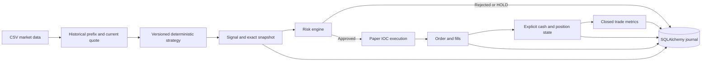

# Deterministic paper trading research

Python 3.12 local, long-only stock simulation. There is no network trading client, live execution route, AI, LLM, or Hermes integration. `MODE` accepts only `paper`; `WebullExecutionEngine.execute()` always raises.

## Quick start (PowerShell)

```powershell
uv python install 3.12
uv venv --python 3.12
uv pip install -r requirements.lock
uv pip install -e . --no-deps
Copy-Item .env.example .env
.venv\Scripts\python.exe -m app.cli init-db
.venv\Scripts\python.exe -m app.cli seed-demo-data
.venv\Scripts\python.exe -m app.cli run-paper
.venv\Scripts\python.exe -m app.cli positions
.venv\Scripts\python.exe -m app.cli trades
.venv\Scripts\python.exe -m app.cli performance
.venv\Scripts\python.exe -m scripts.verify_lifecycle
.venv\Scripts\python.exe -m pytest -q
```

Alternatively create a Python 3.12 venv using `py -3.12 -m venv .venv`, then install the lock file and editable project with that venv's pip. Run commands from the repository root. `init-db` applies Alembic migrations without deleting data. To use the shorthand `python -m app.cli ...`, activate `.venv` first.

Each `run-paper` starts an independent, funded research portfolio with a new run ID. Earlier runs remain queryable via `--run-id`. It does not resume a stopped session. `seed-demo-data` overwrites only the specified CSV (default `data/demo.csv`); do not point it at valuable input data.

## Architecture and flow



`MarketDataProvider`, `Strategy`, and `ExecutionEngine` are typed protocols. Strategies receive only a historical prefix and current position quantity, and return a validated signal. They have no execution dependency. A synchronous loop is sufficient for local CSV replay; an async transport belongs in a future streaming adapter.

The runner captures every strategy evaluation, including warmup HOLDs, then a structured risk decision. HOLD is retained with `NO_ACTION`. Protective exits create separate risk-owned signals; the original strategy signal remains recorded with `PROTECTIVE_EXIT_PENDING`. Stop loss and take profit take precedence over strategy orders. Every bar commits signals, risk decisions, orders, fills, positions, trades, metrics and database events atomically. On failure, that bar rolls back and a separate `SYSTEM_ERROR` marks the run FAILED; prior bars remain committed.

The kill switch blocks new exposure while permitting exits. Entry limits check total shares, percentage of marked equity, symbol notional, cash including simulated costs, daily marked-equity loss, filled entry orders per UTC day, concurrent holdings, and loss cooldown. Daily loss includes unrealized changes. Cooldown begins after the configured consecutive **net losing closed trades**; after expiry another loss starts a new cooldown. Protective orders can still fail for lack of liquidity.

## Database schema and reconstruction

| Tables | Purpose and links |
| --- | --- |
| `strategies`, `strategy_versions` | Unique strategy/version, config JSON and hash, strategy source/hash, optional Git SHA, creation time |
| `runs` | Isolated paper account, version FK, risk/execution settings, input hash, final cash/equity/status |
| `signals` | Run/version FKs, stable signal UUID, action, timestamp, reasons, price and indicator payload |
| `market_snapshots` | One per signal; OHLCV, bid/ask/spread, indicators, extensible metadata, pre-decision portfolio/risk state |
| `risk_decisions` | One per signal, APPROVED/REJECTED and reason codes |
| `orders` | Signal FK, requested type/side/quantity, terminal outcome and reason |
| `fills` | Order, trade and position FKs; timestamp, quantity, price, fees |
| `positions` | Explicit mutable current quantity, average cost, mark and unrealized P&L per run/symbol |
| `trades` | Version, run, position, entry/exit signal FKs; open/closed lifecycle and accounting totals |
| `trade_metrics` | One immutable result per closed trade |
| `daily_metrics` | Latest daily equity, cash, gross realized P&L, fees, unrealized P&L and daily change |
| `system_events` | Structured transitions with run/signal links and related IDs in payload |

Follow `trade.entry_signal_id → market_snapshots/risk_decisions → orders → fills`, and the equivalent exit path. Fills reference the same trade and explicit position. Scaling and partial exits retain all fill links even though `exit_signal_id` denotes the latest exit. `POSITION_*` events preserve changing quantities and cost basis. `scripts.verify_lifecycle` independently checks these links and reconciles cash/equity and closed net P&L from fills.

SQLite foreign keys are enabled for application connections. Alembic revisions are static schema snapshots; PostgreSQL-compatible SQLAlchemy types and constraints are used. PostgreSQL requires an installed driver (for example psycopg), a `postgresql+psycopg://...` URL in the local environment, and integration testing; it has not been exercised here. No container is needed for SQLite.

## Reproducibility and configuration

Changing strategy config or class source under the same strategy ID/version fails registration. Increment `version` to create another row; previous rows are never updated by registration. The source snapshot supplements its SHA-256 hash; old rows created before migration 0002 may have no source. Git SHA is nullable outside a Git checkout. Run settings exclude the database URL because it may contain credentials; input bars are hashed and also preserved in signal snapshots. UUIDs and creation timestamps differ on replay; signal actions, fills and financial outcomes are deterministic.

`requirements.lock` pins the tested dependencies. Archive source and the lock file with research results: the saved strategy source is not a substitute for the entire engine/dependency environment. Protect the journal against manual database edits; this foundation does not implement tamper-proof storage or database-level append-only permissions.

Use `.env` or process environment for configuration. Do not commit credentials. No Webull keys or account identifiers are needed by this simulator.

## Simulation assumptions and metric definitions

- One symbol per run, whole shares, USD-like units, cash only, no shorts or leverage. The risk engine can assess portfolios with multiple symbols, but coordinated multi-symbol replay is not implemented.
- CSV columns: `symbol,timestamp,open,high,low,close,bid,ask,volume`. Timestamps must include a timezone; rows must be unique and sorted by symbol/time. Demo uses one-minute bars. Required timeframe is a strategy declaration; provide matching data. No market calendar, stale-feed checks or corporate-action adjustment is inferred.
- Execution uses the current bar-close quote with zero latency. This deliberately optimistic research model avoids future bars but does not model next-tick availability. BUY uses ask plus configured basis-point slippage; SELL uses bid minus slippage. Fees are per filled share.
- Orders are immediate-or-cancel. Non-marketable limits cancel; zero volume rejects; available volume caps quantity and cancels the remainder. Bar volume is a synthetic liquidity cap, not a realistic order-book model. There are no resting orders or exchange queue simulation. The runner submits market orders; limit behavior is available and tested at the execution interface.
- Stops/profits are sampled against bid relative to average entry. No intrabar path is invented from OHLC. End-of-data requests liquidation; an unfilled/partial final exit leaves explicit holdings and `OPEN_POSITIONS`, never a fictitious completed trade.
- Gross P&L = exit proceeds minus entry cost. Fees include all entry and exit fills. Net P&L subtracts fees; return percentage divides net P&L by gross entry cost. Holding duration spans first entry to final exit. Portfolio `realized_pnl` is gross; fees are separately tracked.
- MAE is minimum signed unrealized dollar P&L (at most zero), MFE is maximum (at least zero), sampled at observed closes and execution prices while exposed. They equal `maximum_unrealized_loss/profit`. With partial exits, samples use remaining quantity; these are not intrabar extremes or percentage excursions.
- Slippage metrics are signed dollar execution shortfall versus each signal price, quantity weighted, including spread and configured impact but excluding fees. Negative means price improvement.
- Monetary values use double precision for simulation and reconciliation tolerance `1e-8`; this is not broker-grade decimal settlement. Prices are not rounded to exchange tick sizes.
- Database events are authoritative committed history. `logs/events.jsonl` is diagnostic and may contain attempted events from a rolled-back bar. Runs are single-process and independent; do not share a portfolio across workers.

## Webull Sandbox boundary

The placeholder intentionally contains no SDK client, endpoint, authentication or order submission implementation. A future adapter should use the official `webull-openapi-python-sdk` and verify Sandbox-only endpoints and account selection using [Webull's official SDK and environment documentation](https://developer.webull.com/apis/docs/sdk/) and [getting-started guide](https://developer.webull.com/apis/docs/getting-started/), consulted 2026-09-11. Do not substitute an unofficial Webull API wrapper.

Before adding that adapter, implement and test asynchronous broker events, idempotency/reconciliation, order persistence/recovery, decimal/tick rules, trading-session/feed validation and explicit Sandbox account validation. No Sandbox connection or production trading is enabled by this project.
