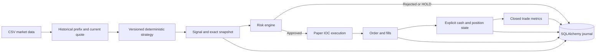

# Deterministic paper trading research

## Phase boundaries

- Phase 1: deterministic local simulation.
- Phase 2: asynchronous broker-safe lifecycle and reconciliation.
- Phase 3: durable broker commands plus an official Webull Thailand TEST adapter.

**PRODUCTION TRADING IS NOT AVAILABLE.** No strategy, risk engine, or paper runner automatically sends Webull orders.

Webull accepts only `WEBULL_TEST_APP_KEY`, `WEBULL_TEST_APP_SECRET`, and `WEBULL_TEST_ACCOUNT_ID`. The adapter fixes `region=th`, `environment=test`, `th-api.uat.webullbroker.com`, and `th-events-api.uat.webullbroker.com`; writes require an exact account-list match. Diagnostics mask credentials and persist only the account hash.

Run `.venv/Scripts/python.exe -m pytest -q`. Read-only connectivity requires `RUN_WEBULL_TH_TEST_INTEGRATION=1`. The separate order contract requires `RUN_WEBULL_TH_TEST_ORDER=1` and remains operator-configured/skipped until safe inputs are selected. CI enables neither flag.

Submit and cancel commands commit before transport. Ambiguous results remain `UNKNOWN`, reconcile by `client_order_id`, and never retry automatically. Trading Events emit domain events; `BrokerExecutionService` remains the accounting boundary and REST reconciliation covers gaps.

Python 3.12 local, long-only stock research. Phase 1 is the deterministic simulator. Phase 2 adds a persisted asynchronous mock-broker lifecycle. Phase 3 exposes a separately invoked Thailand TEST adapter. There is no production execution route, AI, LLM, or Hermes integration. `MODE` accepts only `paper`.

## Quick start (PowerShell)

```powershell
uv python install 3.12
uv venv --python 3.12
uv pip install -r requirements.lock
uv pip install -e . --no-deps
Copy-Item .env.example .env
.venv\Scripts\python.exe -m app.cli init-db
.venv\Scripts\python.exe -m app.cli seed-demo-data
.venv\Scripts\python.exe -m app.cli run-paper
.venv\Scripts\python.exe -m app.cli positions
.venv\Scripts\python.exe -m app.cli trades
.venv\Scripts\python.exe -m app.cli performance
.venv\Scripts\python.exe -m scripts.verify_lifecycle
.venv\Scripts\python.exe -m pytest -q
.venv\Scripts\python.exe -m pytest tests/test_phase2.py -q
```

Alternatively create a Python 3.12 venv using `py -3.12 -m venv .venv`, then install the lock file and editable project with that venv's pip. Run commands from the repository root. `init-db` applies Alembic migrations without deleting data. To use the shorthand `python -m app.cli ...`, activate `.venv` first.

Without `--run-id`, `run-paper` explicitly creates an independent, funded portfolio. Use `run-paper --run-id UUID` with the same CSV, settings, strategy version and quantity to resume a checkpointed run. `--max-bars 3` pauses after three additional bars without forcing liquidation. Recovery replays persisted fills, reconciles explicit positions/cash/equity, restores daily limits and cooldown state, and continues from the next uncommitted bar. Replaying an already finished run does nothing. Pre-audit runs with no checkpoint remain queryable but cannot resume; they fail closed rather than receiving new cash. `seed-demo-data` overwrites only the specified CSV (default `data/demo.csv`); do not point it at valuable input data.

## Architecture and flow



`MarketDataProvider`, `Strategy`, and `ExecutionEngine` are typed protocols. Strategies receive only a historical prefix and current position quantity, and return a validated signal. They have no broker dependency. `run_paper(..., execution_engine=...)` supports dependency injection and defaults to the original local engine.

The separate Phase 2 `Broker` protocol exposes asynchronous submit/cancel, order, open-order, bounded paginated order-history, fill, position and account queries, restart recovery and reconciliation. The deterministic mock broker requires no network. An order intent is persisted as `CREATED` before submission; broker events then move it through `SUBMITTING`, `SUBMITTED`, `ACKNOWLEDGED`, `PARTIALLY_FILLED`, `FILLED`, `CANCEL_PENDING`, `CANCELLED`, `REJECTED`, `EXPIRED`, or `UNKNOWN`. Illegal transitions fail explicitly. Late status events are retained as `OUT_OF_ORDER_IGNORED` and do not regress state.

The runner captures every strategy evaluation, including warmup HOLDs, then a structured risk decision. HOLD is retained with `NO_ACTION`. Protective exits create separate risk-owned signals; the original strategy signal remains recorded with `PROTECTIVE_EXIT_PENDING`. Stop loss and take profit take precedence over strategy orders. Every bar commits signals, risk decisions, orders, fills, positions, trades, metrics and database events atomically. On failure, that bar rolls back and a separate `SYSTEM_ERROR` marks the run FAILED; prior bars remain committed.

The kill switch blocks new exposure while permitting exits. Entry limits check total shares, percentage of marked equity, symbol notional, cash including simulated costs, daily marked-equity loss, filled entry orders per UTC day, concurrent holdings, and loss cooldown. Daily loss includes unrealized changes. Cooldown begins after the configured consecutive **net losing closed trades**; after expiry another loss starts a new cooldown. Protective orders can still fail for lack of liquidity.

## Database schema and reconstruction

| Tables | Purpose and links |
| --- | --- |
| `strategies`, `strategy_versions` | Unique strategy/version, config JSON and hash, strategy source/hash, optional Git SHA, creation time |
| `runs` | Isolated paper account, version FK, risk/execution settings, input hash, cash/equity/status, atomic replay checkpoint and revision |
| `signals` | Run/version FKs, stable signal UUID, action, timestamp, reasons, price and indicator payload |
| `market_snapshots` | One per signal; OHLCV, bid/ask/spread, indicators, extensible metadata, pre-decision portfolio/risk state |
| `risk_decisions` | One per signal, APPROVED/REJECTED and reason codes |
| `orders` | Signal FK, requested type/side/quantity, terminal outcome and reason |
| `fills` | Order, trade and position FKs; timestamp, quantity, price, fees |
| `positions` | Explicit mutable current quantity, average cost, mark and unrealized P&L per run/symbol |
| `trades` | Version, run, position, entry/exit signal FKs; open/closed lifecycle and accounting totals |
| `trade_metrics` | One immutable result per closed trade |
| `daily_metrics` | Latest daily equity, cash, gross realized P&L, fees, unrealized P&L and daily change |
| `system_events` | Structured transitions with run/signal links and related IDs in payload |
| `broker_accounts`, `broker_positions` | Safe account reference and exact cash, quantity, basis, P&L and fee state |
| `broker_orders` | Internal/client/broker IDs, approved-risk link, exact intent, lifecycle state and filled quantity |
| `broker_events`, `broker_fills` | Normalized idempotent events and exact executions that drive accounting |

Follow `trade.entry_signal_id → market_snapshots/risk_decisions → orders → fills`, and the equivalent exit path. Fills reference the same trade and explicit position. Scaling and partial exits retain all fill links even though `exit_signal_id` denotes the latest exit. `POSITION_*` events preserve changing quantities and cost basis. `scripts.verify_lifecycle` independently checks these links and reconciles cash/equity and closed net P&L from fills.

SQLite foreign keys are enabled for application connections. Alembic revisions are static schema snapshots; PostgreSQL-compatible SQLAlchemy types and constraints are used. PostgreSQL requires an installed driver (for example psycopg), a `postgresql+psycopg://...` URL in the local environment, and integration testing; it has not been exercised here. No container is needed for SQLite.

## Reproducibility and configuration

Changing strategy config or class source under the same strategy ID/version fails registration. Increment `version` to create another row; previous rows are never updated by registration. The source snapshot supplements its SHA-256 hash; old rows created before migration 0002 may have no source. Git SHA is nullable outside a Git checkout. Run settings exclude the database URL because it may contain credentials; input bars are hashed and also preserved in signal snapshots. UUIDs and creation timestamps differ on replay; signal actions, fills and financial outcomes are deterministic.

`requirements.lock` pins the tested dependencies. Archive source and the lock file with research results: the saved strategy source is not a substitute for the entire engine/dependency environment. Protect the journal against manual database edits; this foundation does not implement tamper-proof storage or database-level append-only permissions.

Use `.env` or process environment for configuration. Do not commit credentials. No Webull keys or account identifiers are needed by this simulator.

## Simulation assumptions and metric definitions

- One symbol per run, whole shares, USD-like units, cash only, no shorts or leverage. The risk engine can assess portfolios with multiple symbols, but coordinated multi-symbol replay is not implemented.
- CSV columns: `symbol,timestamp,open,high,low,close,bid,ask,volume`. Timestamps must include a timezone; rows must be unique and sorted by symbol/time. Demo uses one-minute bars. Required timeframe is a strategy declaration; provide matching data. No market calendar, stale-feed checks or corporate-action adjustment is inferred.
- Execution uses the current bar-close quote with zero latency. This deliberately optimistic research model avoids future bars but does not model next-tick availability. BUY uses ask plus configured basis-point slippage; SELL uses bid minus slippage. Fees are per filled share.
- Orders are immediate-or-cancel. Non-marketable limits cancel; zero volume rejects; available volume caps quantity and cancels the remainder. Bar volume is a synthetic liquidity cap, not a realistic order-book model. There are no resting orders or exchange queue simulation. The runner submits market orders; limit behavior is available and tested at the execution interface.
- Stops/profits are sampled against bid relative to average entry. No intrabar path is invented from OHLC. End-of-data requests liquidation; an unfilled/partial final exit leaves explicit holdings and `OPEN_POSITIONS`, never a fictitious completed trade.
- Gross P&L = exit proceeds minus entry cost. Fees include all entry and exit fills. Net P&L subtracts fees; return percentage divides net P&L by gross entry cost. Holding duration spans first entry to final exit. Portfolio `realized_pnl` is gross; fees are separately tracked.
- MAE is minimum signed unrealized dollar P&L (at most zero), MFE is maximum (at least zero), sampled at observed closes and execution prices while exposed. They equal `maximum_unrealized_loss/profit`. With partial exits, samples use remaining quantity; these are not intrabar extremes or percentage excursions.
- Slippage metrics are signed dollar execution shortfall versus each signal price, quantity weighted, including spread and configured impact but excluding fees. Negative means price improvement.
- Entry slippage = `(buy fill - entry signal price) * filled quantity`; exit slippage = `(exit signal price - sell fill) * filled quantity`. Add the two for total slippage. Market orders have no requested/limit price (`null`); the signal price is the analytical reference, not a promised execution price. Slippage is already included in gross P&L through actual fills and must not be subtracted again.
- Paper fees = `filled quantity * fee_per_share` for **each unique fill**, on both buys and sells. The default is 0.005 per share. Zero fills means zero fees. The same fee appears in cash accounting, trade summaries and metrics as linked views of one charge, not separate deductions. No minimum commission, taxes or regulatory fees are modeled.
- Phase 1 values remain double precision to preserve its audited result. Phase 2 broker/accounting boundaries parse finite `Decimal` values and persist canonical decimal text without binary-float conversion. Values are never silently rounded. Optional price/quantity increments are validated exactly only when verified instrument metadata is supplied; no Webull tick or quantity rule is invented.
- Database events are authoritative committed history. `logs/events.jsonl` is diagnostic and may contain attempted events from a rolled-back bar. Runs are single-process and independent; do not share a portfolio across workers.

## Webull Thailand test boundary

Webull Thailand publishes an official OpenAPI developer site at `developer.webull.co.th`. The Thailand SDK examples use region `th`. The official API-environments page documents a separate **Test** environment: Trading API `th-api.uat.webullbroker.com` and Trading Events (gRPC) `th-events-api.uat.webullbroker.com`. It also documents official Python/Java SDKs, client-generated order IDs, account IDs, stock order placement, and asynchronous order-status events. Production is a separate environment and is deliberately not representable by this repository's execution configuration.

`WebullTestConfig` (with backward-compatible import name `WebullSandboxConfig`) accepts only broker `webull`, region `th`, environment `test`, and the exact Thailand test hosts above. Credentials come only from `WEBULL_TEST_APP_KEY`, `WEBULL_TEST_APP_SECRET`, and `WEBULL_TEST_ACCOUNT_ID`; diagnostics mask them and only a SHA-256 account reference may be stored. `.env` remains ignored and `.env.example` contains placeholders only.

`WebullTestAdapter` uses the official pinned SDK for normalized account, order, fill, and position operations. It attests the configured TEST account before every first write. External authenticated behavior is not claimed until the opt-in integration tests succeed. There is no production fallback or live mode.

## Phase 2 accounting, recovery and reconciliation

Only unique normalized broker fills mutate Phase 2 cash, positions, weighted basis, realized P&L, and per-fill fees. `SUBMITTING` explicitly permits a fill-first race to `PARTIALLY_FILLED` or `FILLED`; a later acknowledgment is retained for audit without regressing state. During cancellation, valid additional fills are still applied. If a fill arrives after `CANCELLED`, a partial authoritative fill is retained with the cancelled remainder, while a fill completing the entire order supersedes cancellation and ends as `FILLED`. A fill after `REJECTED`, `EXPIRED`, or an already complete `FILLED` order is a safety-critical consistency error and cannot mutate accounting.

Broker-event processing uses the caller-managed SQLAlchemy transaction as the durability boundary. All domain validation that can reject a fill is performed before state/accounting mutation; database failures require transaction rollback. The runner/tests use transaction contexts so event, fill, cumulative quantity, cash, position, fees, and order state commit or roll back together. Recovery replays events idempotently. A `SUBMITTING` order is treated as an unknown submission outcome and cannot be blindly re-submitted; reconciliation must establish broker state first.

Reconciliation uses an explicit timezone-aware bounded history window plus open-order and known-local-order queries. The broker protocol exposes paginated `query_order_history`, so terminal broker orders that never reached the local database can be reported as `LOCAL_MISSING`; open orders are not treated as complete history. Reconciliation remains detection-only and reports `MATCH`, `LOCAL_MISSING`, `BROKER_MISSING`, `STATUS_MISMATCH`, `QUANTITY_MISMATCH`, `CASH_MISMATCH`, `POSITION_MISMATCH`, or `UNKNOWN`. Conflicting duplicate remote records are surfaced as `UNKNOWN`. It never overwrites or deletes history.

See [PHASE2_AUDIT.md](PHASE2_AUDIT.md) for evidence and known limits.

## Phase 1 recovery and duplicate boundary

Paper terminal IOC results now have stable order/fill IDs. Identical signal, terminal order-result or fill replays are no-ops; reused IDs with changed payloads fail explicitly. Signals also have a unique semantic decision key per run/version/symbol/time/source, so regenerating a UUID does not create a second decision. Fill IDs are primary keys. Multi-fill results are deduplicated and validated before accounting; filled quantity, per-fill fees and available position/cash must reconcile. The filled-entry-order limit counts orders, not component fills.

All result processing must run inside the caller's database transaction, as the runner does. On any exception discard the in-memory portfolio and reload the committed checkpoint. A revision check prevents a stale runner from committing the same bar. This is a local paper replay boundary, not a live broker event ingestion/reconciliation system. Broker streaming and partial-to-final asynchronous transitions remain out of scope.

See `PHASE1_AUDIT.md` and `data/phase1-original-audit.json` for the independent Decimal audit of the original results, full IDs, signal categories and price-by-price excursion calculations. The existing diagnostic verifier remains available as `python -m scripts.verify_lifecycle`.
